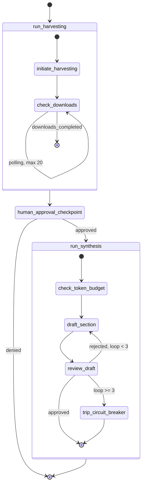
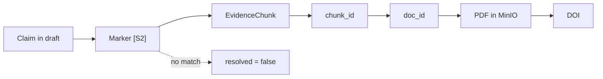

Every run produced the same fake reference.

The system looked like it was working. It searched the literature, returned a list of papers, and drafted a fluent paragraph about GLP-1 agonists in Alzheimer's models. The prose was confident. The pharmacology was plausible. And at the end of a sentence about neuroprotective mechanisms sat a citation: `10.1038/xyz`.

That DOI does not exist. It never existed. It was a placeholder string sitting in a retrieval stub, and because nothing downstream checked whether a citation resolved to anything real, it flowed straight through the drafting agent, past the reviewing agent, and into the output as if it were evidence.

I want to be precise about why this matters, because "AI hallucinates sometimes" is the wrong lesson. The failure was not that a language model invented a reference. Language models invent references; that is a known property of the technology. The failure was that **the system had no mechanism by which an invented reference could be detected.** A free-text citation like `[Author, Year, DOI]` is just characters. There is nothing to check it against. The architecture offered no way to distinguish a real source from a convincing string, so the distinction never got made.

That is the problem Research OS was built around. Not "make the model better behaved," but "change the data structures so that fabrication becomes mechanically detectable."

This article walks through what Research OS is today, how it is architected, what it deliberately refuses to do, and where it is going. I am building it in the open, so I will be equally specific about what is not built yet — including the medicinal chemistry layer that the project's whole domain framing points toward and that does not exist in the codebase today.

## Why existing research workflows break down

Before the architecture, the problem. If you have run a literature review inside a drug discovery programme, none of this will be news, but it is worth naming the failure modes precisely because each one maps to a design decision later.

### The tools do not talk to each other

A typical review touches a reference manager, a PDF folder, a spreadsheet of extracted data, a notebook of analysis, a slide deck of findings, and a manuscript. Six tools, six data models, and no shared identity for the thing they are all supposedly about — the paper. The DOI in your reference manager and the filename of the PDF on disk and the row in your extraction spreadsheet are three different representations with no enforced link between them.

The consequence is that provenance is maintained by human diligence. When someone asks "where did this potency number come from," the answer lives in whoever did the extraction, and it decays on a timescale of months.

### The literature has outgrown reading

Any therapeutically interesting target has more published work than a person can read, and the volume grows faster than anyone's reading speed. So teams sample. They read the recent, the highly cited, and the papers they already knew about. That is a rational strategy under time constraints and a badly biased one — it systematically underweights older work, negative results, and anything outside the citation cluster you already inhabit.

Search tools help with recall but not with synthesis. Getting four hundred hits is not the same as understanding a field.

### Reproducibility fails at the seams

A computational result is reproducible when someone else can rerun it. A literature synthesis is reproducible when someone else can determine which sources supported which claim. The second is much rarer, because the reasoning that connects a sentence in a review to a passage in a paper is almost never recorded. It happened in someone's head, and then it was gone.

This is the gap that generative AI makes dramatically worse. A model can produce a paragraph that reads exactly like a well-sourced synthesis without any of the underlying reading having occurred. The output is fluent, the citations are formatted correctly, and there is no trace to follow.

### Institutional knowledge evaporates

When a postdoc leaves, the reasoning behind two years of compound prioritization leaves with them. The lab keeps the assay data and loses the interpretation. Every new person rebuilds the same mental model of the same literature, and there is no substrate that accumulates.

These four problems have a common shape. They are all failures of **connective tissue** — not any single tool being bad, but nothing binding the tools into a system with memory and provenance. That is why the framing is an operating system rather than an application: the missing layer is the one that gives everything else a shared address space.

## What Research OS actually is

Research OS is a multi-agent system for scientific literature review and manuscript drafting. It runs on a LangGraph control plane with Celery workers, Redis for state, MinIO for documents, and a Chroma vector index. It is currently a **working prototype**, and I use that term in its technical sense: the pipeline runs end to end, it is tested, and it is not production infrastructure.

Given a natural-language research question, it does seven things:

1. **Harvests** candidate papers from OpenAlex, Crossref, and Semantic Scholar, then merges and deduplicates the results.
2. **Downloads** the PDFs asynchronously on Celery workers, validating that what came back is actually a PDF.
3. **Parses and chunks** each document with layout heuristics tuned for scientific papers, preserving section headings and page numbers.
4. **Indexes** the chunks in a per-session vector collection using a biomedical embedding model.
5. **Pauses** for a human to approve the literature list before any drafting begins.
6. **Drafts** a review section using only passages retrieved from that corpus, citing them by resolvable markers.
7. **Verifies** the draft mechanically, then peer-reviews it with a second model, looping until approval or a hard circuit breaker.

The important part is step 6 and 7 together, so let me be concrete about the mechanism.

When the Synthesizer drafts, it is not given the corpus. It is given a numbered list of retrieved passages — `S1`, `S2`, `S3` — and instructed to cite by marker. Each marker corresponds to an `EvidenceChunk`, a typed object carrying the passage text plus its `chunk_id`, source document hash, DOI, section heading, and page number.

This changes what a citation *is*. It is no longer a string the model composed. It is a reference into a set the system controls. And that makes the check trivial: take every marker in the draft, look it up in the evidence set, and any marker that does not resolve is fabricated. Not "probably fabricated" or "flagged as suspicious by a judge model" — fabricated, by construction, because the model cited something it was never given.

The code comment in the schema puts it plainly:

> Numbering the evidence and requiring the model to cite by label is what makes fabrication structurally detectable: a marker outside the supplied set is by definition invented, and a claim with no marker is by definition unsupported.

That second clause matters as much as the first. A paragraph that makes assertive claims and carries no marker at all is also caught, because an unattributed claim is indistinguishable from model recall.

### What Research OS is not, today

I would rather you learn this here than by cloning the repository.

There is **no chemistry layer**. No RDKit, no SMILES or InChI handling, no compound identity, no fingerprints, no scaffolds. Despite a stated domain focus on medicinal chemistry and clinical pharmacology, the software today has no molecular capability whatsoever. That is the next roadmap phase, and I will come back to it.

There is **no molecular docking**, and no design for it in the repository.

There is **no web interface**. The entire user interface is a terminal session. There is also no HTTP API — `fastapi` sits in the requirements file as a leftover, with no application behind it.

There is **no telemetry, no cost tracking, and no continuous integration**. There are 27 tests, but nothing enforces them on change.

The system currently drafts **one section per run**. That is a demonstration of the grounding loop, not a manuscript workflow.

I am listing these because the credibility of the parts that do work depends on being honest about the parts that do not. A capability matrix in the repository documentation states all of this in the same terms, for the same reason.

## Architecture deep dive

### The control plane

Orchestration is three compiled LangGraph state machines: a supervisor and two subgraphs.

The supervisor is compiled with an interrupt before the approval checkpoint. Execution genuinely halts there — the graph state is checkpointed, the process waits for a human decision, and synthesis cannot begin without it. This is the single most effective cost control in the system, because it puts a person between "we found some papers" and "we start spending tokens on them."

### State offloading

LangGraph edges carry only pointers and scalars. Nothing dense travels on the graph.

```mermaid
flowchart LR
    subgraph Graph["Graph edges: pointers and scalars"]
        S1[session_id]
        S2[harvested_document_ids]
        S3[loop_counter]
    end

    subgraph Redis["Redis - state:session_uuid"]
        R1[harvested_metadata]
        R2[manuscript_drafts]
        R3[current_evidence]
        R4[critic_report]
        R5[citations]
    end

    subgraph MinIO["MinIO - research-os-docs"]
        M1[session_uuid/doc_id.pdf]
    end

    subgraph Chroma["Chroma - per-session collection"]
        V1[chunk embeddings]
        V2[provenance metadata]
    end

    Graph -->|cache_operational_state| Redis
    Redis -->|get_operational_state| Graph
    Graph -.doc_id.-> MinIO
    MinIO --> Chroma
```

Session state lives in Redis under `state:{session_uuid}` with a one-hour TTL. Raw PDFs go to MinIO. Embeddings go to a Chroma collection scoped to the session. The graph itself holds a session ID, a list of document hashes, a loop counter, and a handful of flags.

This is a deliberate constraint rather than an optimization. Once dense payloads are allowed onto graph edges, state grows with corpus size, checkpointing gets expensive, and the failure modes become memory-shaped. Keeping edges thin means the orchestration layer stays comprehensible no matter how large the corpus gets.

### Acquisition and the corpus poisoning problem

Downloads run as Celery tasks with three retries. The interesting part is what happens to the response.

Publishers frequently return HTTP 200 with an HTML login wall, a cookie consent page, or a "your institution does not have access" interstitial. A naive pipeline stores that as a PDF, parses it into garbage text, embeds the garbage, and then retrieves it as evidence. You have poisoned your own corpus with content that has nothing to do with the paper, and every downstream check will pass because the text is real text.

So the worker validates magic bytes and content type before storage, with a size cap. Anything that fails is recorded as `NOT_A_PDF` in a tracker and written to a failure ledger — an Excel file guarded by a module-level file lock so concurrent workers cannot corrupt it. Paywalls and rate limits are logged with a typed `AccessStatus` rather than being silently dropped.

That ledger is a deliberate product decision. A paper the system could not obtain is not noise to be discarded; it is a known gap in the evidence base, and a researcher should be able to see it and go fetch it manually.

On which note: an earlier design mandated stealth scraping — rotating proxies, browser fingerprint evasion, CAPTCHA bypass. That was removed. A 403 is now a terminal outcome that gets logged, not an obstacle to route around. Beyond the legal exposure, a research integrity tool that begins by violating access terms is arguing against itself.

### Parsing and retrieval

PDF parsing uses PyMuPDF with heuristics aimed at scientific documents: a regex over standard section names, bold-flag detection, and relative font-size comparison to identify headings. Text is chunked at 500 tokens with 50 tokens of overlap using tiktoken.

Every chunk keeps its provenance — document hash, DOI, heading, page number — because, as the source comment puts it, retrieval that cannot name its source cannot support a citation.

Embeddings default to `pritamdeka/S-PubMedBert-MS-MARCO`, a biomedical-domain model, running locally. The reasoning is specific: general-purpose embeddings underperform on pharmacology text because the discriminating vocabulary *is* the specialist terminology. A model that treats "selective" and "potent" as near-synonyms is not useful when the distinction between them is the entire point of a paper.

Retrieval uses maximal marginal relevance, implemented directly rather than pulled from a framework. It overfetches 30 candidates and greedily selects 8, at each step maximising relevance to the query minus redundancy against what is already selected. Without this, a section gets drafted from eight near-identical passages of the same paper — technically relevant, evidentially worthless.

### The verification layer

This is the part I would defend hardest.

Before the LLM Critic sees a draft, a deterministic verifier runs. It contains no model call. It walks each paragraph and applies four checks:

| Check | Classified as |
|---|---|
| A citation marker not in the supplied evidence set | Hallucination |
| An inline hand-written DOI | Citation mismatch |
| An inline hand-written author-year reference | Citation mismatch |
| An assertive paragraph carrying no marker at all | Hallucination |

Checks two and three exist because the specific failure habit was the model writing its own reference instead of using the marker system. That habit is now caught by a regular expression.

The verifier's findings are passed into the Critic as authoritative and force rejection. The rationale, from the module docstring:

> The Critic is an LLM judging prose against prose, which is a weak guarantee: it can be argued out of a finding, and it can approve a draft whose citations do not exist. Much of what matters here is mechanically checkable instead.

Facts outrank judgments. An LLM reviewer is genuinely useful for assessing whether an argument follows, whether a methodological caveat has been dropped, whether a claim overgeneralizes from one model system. It is not the right instrument for asking whether a citation exists, because that question has a deterministic answer and deterministic answers should not be delegated to something that can be talked out of them.

### The review loop

Drafting and review run in a cycle with two safety properties.

First, **evidence travels with the draft.** The Critic and the verifier receive the exact passages the Synthesizer was given, stored alongside the draft, rather than running their own retrieval. If the reviewer queried independently, it might pull different passages, find something that superficially supports a fabricated claim, and approve it. Reviewing attribution means looking at the evidence the draft actually claims to rest on.

Second, a **circuit breaker**. If the Critic rejects three times, the loop hard-routes to termination with a tripped flag rather than continuing. Agent loops that revise until satisfied are an unbounded spending commitment, and three failed attempts is better evidence that something is structurally wrong than that a fourth attempt will succeed.

There is a third property worth naming: the system **refuses rather than degrades**. If the vector store is unreachable, retrieval raises a typed exception and synthesis is blocked. It does not fall back to drafting from model parameters. The error message says so explicitly — synthesis "would fall back to ungrounded generation, so it is blocked instead." Silent degradation is how you get confident, unsourced, wrong output, which is worse than no output because it looks like work.

## AI-native research infrastructure

### The gateway

All model calls go through one async gateway supporting four providers — Google Gemini, OpenRouter, MiniMax, and Moonshot — behind a single interface. It enforces 120-second timeouts on every phase, strips markdown code fences before JSON validation (a persistent annoyance when models wrap structured output in backticks), retries with exponential backoff, short-circuits on auth errors rather than burning retries, and logs token usage.

Structured outputs are validated into Pydantic models. A malformed `CriticReport` raises a typed gateway exception instead of propagating a validation error into the graph.

### Deliberate provider diversity

The Synthesizer and the Critic run on **different providers**. This is not load balancing. A model reviewing its own output shares its own blind spots and is measurably more willing to approve its own fabrications. Splitting the roles across vendors means the reviewer's failure modes are at least uncorrelated with the writer's.

It is a cheap control and an unusually effective one, and it generalizes: wherever you have a generate-then-check pattern, having both halves come from the same weights weakens the check.

### Where the intelligence actually lives

Worth noting what does *not* use a model. The Harvester makes no LLM calls — it is HTTP adapters, deduplication logic, and status computation. The verifier makes no LLM calls. Deduplication compares DOIs, PubMed IDs, corpus IDs, and title similarity by Jaccard coefficient at a 0.92 threshold.

This is a design position. Language models are for the things that genuinely require language understanding — synthesis, critique, judgment about scientific argument. Everything mechanically decidable should be decided mechanically, because deterministic code is cheaper, faster, testable, and does not need to be persuaded.

### Knowledge management today

Each session gets its own vector collection, its own document prefix in object storage, and its own Redis state key. Provenance metadata rides with every chunk.

Cross-session knowledge — a persistent corpus that accumulates across projects — is **not built**. A design document in the repository proposes a citation-graph layer on Postgres with pgvector, drawing on the Semantic Scholar Academic Graph, and it is explicitly annotated as a proposal with no corresponding code. I mention it because it is the natural next structural step, not because it exists.

## Scientific use cases

Here I want to separate carefully what the platform does today from what the roadmap targets, because this is exactly where technical writing about research software tends to blur.

### Literature review — working today

The end-to-end path is built. Ask a question, get real papers from three sources, review the list, approve it, and receive a drafted section where every claim carries a marker that resolves to a specific passage on a specific page of a specific paper.

The concrete value is not the drafting. It is that the output arrives with its evidence attached. When a reviewer asks where a claim came from, the answer is a chunk ID, a document hash, and a page number rather than a recollection.

### Manuscript grounding — working today

The verification layer is usable independently of the drafting layer. Given a draft and the evidence it was built from, it will tell you which claims lack attribution and which citations do not resolve. For a lab already using language models to accelerate writing — and many are, whether or not it is discussed openly — this is the missing control.

### Systematic review support — partially planned

Multi-source harvesting with deduplication and a typed failure ledger covers part of what a systematic review needs. What is missing is PRISMA search logging, a screening gate, the flow diagram, and export to BibTeX, RIS, or DOCX with a provenance appendix. That is Phase 6 on the roadmap. Until it lands, this is not a systematic review tool.

### Medicinal chemistry — roadmap, not built

This is the honest centre of the project's gap. The domain focus is medicinal chemistry; the chemistry layer does not exist.

The planned work is specific:

- **RDKit core** — InChIKey-based compound identity, descriptors, Lipinski/Veber/QED filters, ligand efficiency metrics (LE and LLE), PAINS alerts
- **Database grounding** — checking extracted claims against ChEMBL, PubChem, UniProt, Open Targets, ClinicalTrials.gov, and patent literature
- **SAR extraction** — table-aware parsing with unit normalization, and optionally optical chemical structure recognition for depicted structures
- **Chemistry-aware retrieval** — ECFP4 fingerprints with Tanimoto similarity, Murcko scaffold clustering, maximum common substructure

The reason this ordering makes sense is that each of those capabilities depends on the grounding layer being trustworthy first. Structure-aware retrieval over a corpus you cannot cite reliably would be a faster way to produce unverifiable claims.

When it does land, the target workflow is a meaningful extension of what exists: a stated potency would be checkable not only against the passage it came from but against curated bioactivity data, and retrieval could run over chemical space rather than only text.

### Computational chemistry and laboratory management

*Not confirmed from repository.* There is no computational chemistry integration, no docking, no simulation interface, no LIMS or ELN connectivity, and no instrument data handling in the codebase or the roadmap. I would rather say so than construct a plausible-sounding paragraph.

## Why this matters

### Reproducibility becomes structural

Reproducibility in literature work usually depends on discipline — careful note-taking, honest citation practice, someone remembering to record where a number came from. Discipline degrades under deadline.

The alternative is making provenance a property of the data structures. If a citation is a reference into a controlled set rather than a string, then an unresolvable citation is a type error rather than a lapse. It fails loudly and immediately, and it fails the same way at 2am before a submission as it does on a quiet Tuesday.

### Scale without proportional trust loss

The usual bargain with automation is throughput for confidence. Process ten times the papers, trust the output ten times less.

Grounded output changes the shape of that trade. You still review, but you review claims against attached evidence rather than reconstructing where each one came from. Verification effort grows more slowly than corpus size, which is the only way scaling in this domain is worth anything.

### Institutional memory as infrastructure

Currently, sessions are isolated and Redis state expires after an hour. But the architecture — content-addressed documents, provenance-carrying chunks, a typed evidence model — is the substrate a persistent institutional corpus would need. The proposed citation-graph layer is the obvious direction, and the reason a knowledge graph is worth proposing rather than a folder of PDFs is that the relationships between papers are where the institutional knowledge actually lives.

### Augmentation with a person in the loop

The human approval gate is not a compliance gesture. It is placed at the point of maximum leverage: after the system has done the expensive, boring work of searching and deduplicating, and before it does the expensive, consequential work of drafting. A researcher looks at a list of papers and makes a judgment. That is a good use of expert attention. Reading four hundred abstracts to build the same list is not.

The general principle — automate the mechanical, keep humans on the judgment — is one I have written about [in a more general setting](/blog/research-automation-human-loop), and Research OS is the most demanding test of it I have built.

## Future vision

Everything here is drawn from the repository roadmap rather than speculation.

**Near term: closing the acquisition gap.** OCR fallback for scanned PDFs — currently a scanned document records an empty parse, which excludes exactly the older medicinal chemistry literature the domain needs. An open access resolution ladder through Unpaywall, Europe PMC, and PMC to raise full-text yield beyond a single direct fetch. DOI resolution and retraction screening in the verifier, because a marker resolving to a real chunk does not currently tell you whether the underlying paper has been withdrawn.

**Medium term: the chemistry layer.** Phases 2 through 5, as described above. This is the stated next priority and the largest single piece of unbuilt work.

**Medium term: review deliverables.** PRISMA logging, screening gate, flow diagram, and export with a provenance appendix — the difference between a tool that drafts and a tool whose output can be submitted.

**Cross-cutting: production readiness.** A durable checkpointer replacing the in-process one, so a killed process does not lose a session. Postgres as a system of record, because compound, SAR, and citation data are relational and will not fit in a spreadsheet. Real telemetry and a spending cap. A worker pool configuration fix. Recorded HTTP fixtures so the literature adapters can be tested without hitting live APIs.

**Longer term: the knowledge graph.** The proposed citation-graph layer would move the system from per-session corpora to a persistent, queryable map of a research domain — the point at which "operating system" stops being aspirational.

Two things I want to be careful about. First, "autonomous research workflows" is a phrase I am reluctant to use for this system. The architecture deliberately puts a human at the approval gate and deliberately refuses to proceed without evidence. Those are not limitations to be engineered away; they are the design. A more capable version of this system removes drudgery and surfaces evidence faster. It does not remove the scientist.

Second, the operating system framing is a claim about *layer*, not autonomy. An operating system does not do your work. It provides the shared abstractions — addressing, scheduling, a filesystem — that make applications possible. What scientific software lacks is that layer: a shared notion of what a document is, what a claim is, and what it means for one to support the other. Research OS is an attempt at those abstractions in one domain. Whether it earns the name depends on whether the abstractions turn out to be the right ones, which is not a question you can settle by asserting it.

## Conclusion

The fabricated DOI was useful. It was a small, unambiguous, reproducible failure that pointed at something structural: a system where nothing could distinguish a real citation from an invented one was always going to produce invented ones, and no amount of prompt engineering was going to change that.

The fix was architectural. Make evidence a typed object. Make citations references into a controlled set. Check them deterministically, before any model gets a vote, and let the mechanical findings outrank the judgment ones. Refuse to produce output when the grounding is unavailable rather than degrading quietly into something that looks like work.

None of that is exotic. It is ordinary engineering discipline applied to a domain where the cost of a plausible-sounding error is unusually high. That, I think, is the actual lesson: scientific software fails less often for want of clever models than for want of the boring structural guarantees that make errors visible.

Research OS is a working prototype with a substantial roadmap ahead of it, and the honest summary is that it does literature review well and does not do chemistry yet. But the layer it is building toward — shared abstractions for documents, claims, and evidence, with provenance as a structural property rather than a discipline — is the layer scientific research has been missing.

Turning literature into knowledge you can trust is not, in the end, a modelling problem. It is a question of whether the path from a sentence back to its source survives every step in between. Build that path into the data structures and trust stops being something you extend to the output on faith. It becomes something you can check.

---

*I build custom scientific software for drug discovery — RDKit pipelines, cheminformatics tooling, and research automation. If you are dealing with fragmented research workflows or evaluating AI tooling for scientific writing, [get in touch](/contact) or take a look at [what I work on](/services). You might also be interested in [RDKit workflows chemists actually reuse](/blog/rdkit-workflows-for-chemists) or [why biotech should hire domain-aware software builders](/blog/scientific-software-vs-generic-dev).*
